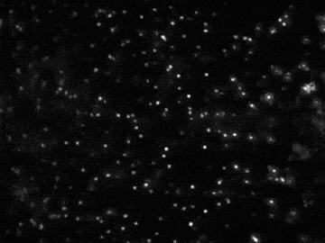

# Atomic Nature of Matter

- The project of ```Princeton university```



Check the website [here](https://introcs.cs.princeton.edu/java/assignments/atomic.html) so as to download the dataset. 

Re-affirm the atomic nature of matter by tracking the motion of particles undergoing Brownian motion, fitting this data to Einstein's model, and estimating Avogadro's number.

### Historical:
The atom was crucial to the development of physics and chemistry in the 20th century, yet until 1908, not everyone recognized the existence of atoms and molecules. Robert Brown, a botanist, used a microscope to study the erratic, random motion of particles in water-immersed wildflower pollen grains in 1827. Later, this motion would be referred to as a ```Brownian motion```. The Brownian motion, according to Einstein's theory, was brought about by millions of tiny water molecules slamming into the bigger pollen grain particles.
Einstein developed a quantitative theory of Brownian motion in one of his "miraculous year" (1905) works in an effort to support the "presence of atoms of definite finite size." His theory gave researchers a way to count molecules using a regular microscope by

### The problem:
In this project, I will redo a version of Perrin's experiment. It is really simplified due to the fact that with modern video and computer technology, it is possible to accurately measure and track the motion of an immersed particle undergoing Brownian motion. The data was supplied by ```Princeton University``` and named as video microscopy data of polystyrene spheres ("beads") suspended in water, undergoing Brownian motion. The data is analyzed and determined how much each bead moves between observations. After being fitted to Einstein's model, it will estimate Avogadro's number.
  
### Particle identification:
Finding the beads in the noisy data is the first difficult task. Each 640 by 480 pixel image requires the conversion of a Color object's value into a luminance value between ```0.0 (black)``` and ```255.0 (white)```. Beads in the foreground are represented by whiter pixels, and water by blacker pixels (background). I divide the issue into three parts: - 1: Read the image, - 2: identify the foreground and background pixels, and - 3: locate the disc-shaped collections of foreground pixels that make up each bead.
Classify the pixels as foreground or background. I divided the pixels into foreground and background components using the straightforward but effective thresholding technique: any pixels with monochrome luminance values exactly below some threshold tau are considered background, while all other pixels are considered foreground. The initial frame and the same frame after thresholding were changed with ```tau = 180.0```, and locate the blobs. A typical representation of a polystyrene bead is a disc-like shape made up of at least some minimal number ```P (usually 25)``` of connected foreground pixels. Regardless of size or shape, a blob or connected component is a maximal set of connected foreground pixels. Any blob with at least P pixels will be referred to as a bead. The average of the x- and y-coordinates of a blob's (or bead's) individual pixels is the blob's center of mass.

Estimating Avogadro's number. Avogadro's number `NA` is defined to be the number of particles in a mole. By definition, k = R / NA, where the universal gas constant R is approximately `8.31457 J K**-1 mol-1`. Use `R/k` as an estimate of Avogadro's number.


### How to run:

#### blob_finder.py
```
python blob_finder.py 0 180.0 run_1/frame00001.jpg
```
#### bead_tracker.py
```
python bead_tracker.py 25 180.0 25.0 run_1/frame00001.jpg  run_1/frame00002.jpg
```
#### avogadro.py
```
python bead_tracker.py 25 180.0 25.0  run_1/frame00000.jpg run_1/frame00001.jpg | python avogadro.py

```
